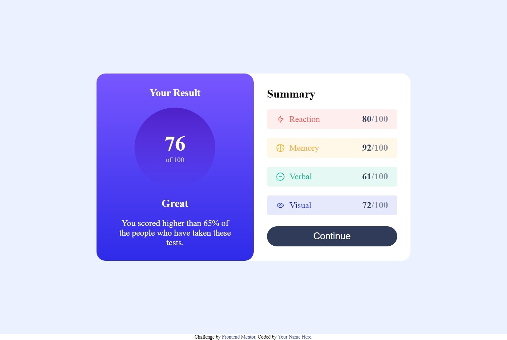
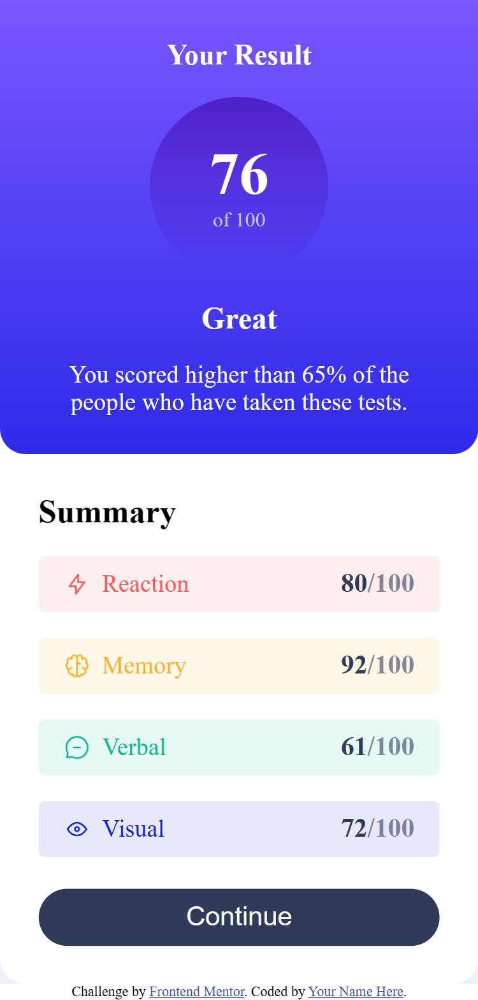

# Frontend Mentor - Results summary component solution

This is a solution to the [Results summary component challenge on Frontend Mentor](https://www.frontendmentor.io/challenges/results-summary-component-CE_K6s0maV).
## Table of contents

- [Frontend Mentor - Results summary component solution](#frontend-mentor---results-summary-component-solution)
  - [Table of contents](#table-of-contents)
  - [Overview](#overview)
    - [The challenge](#the-challenge)
    - [Screenshot](#screenshot)
    - [Links](#links)
  - [My process](#my-process)
    - [Built with](#built-with)
    - [What I learned](#what-i-learned)
    - [Useful resources](#useful-resources)
  - [Author](#author)


## Overview

### The challenge

Users should be able to:

- View the optimal layout for the interface depending on their device's screen size
- See hover and focus states for all interactive elements on the page

### Screenshot




### Links

- Solution URL: [Click Here](https://www.github.com/VishalMauryastp/results-summary-component-main)
- Live Site URL: [Click Here](https://vishalmauryastp.github.io/results-summary-component-main/)

## My process

### Built with

- Semantic HTML5 markup
- Flexbox
- CSS ,Scss/Sass
- JavaScript
- JQuery
- Mobile-first workflow
  


### What I learned

In this challenge I learned ,How to use **json**  data into html file and Add

To see how you can add code snippets, see below:

```JQuery
$.getJSON("/src/assets/data/data.json", (data) => {
  let totalScore = 0;
  let i = 0;
  $.each(data, (indexInArray, valueOfElement) => {
    
    $(".rows").append(
      ` <div class="container__summary__rows d-f jc-sb ai-c " style="background-color:${valueOfElement.bgcolor}">
        <div class="logo d-f">
          
          <p style="color:${valueOfElement.color}" >${valueOfElement.category}</p>
        </div>
        <div class="marks"> <span style="color:hsl(224, 30%, 27%)">${valueOfElement.score}</span>/100</div>
      </div>    `
    );
    i++;
    totalScore = totalScore + valueOfElement.score;
  });
  // Math.floor(totalScore/(i*100)*100)
 $(".percent").text( Math.floor(totalScore/(i*100)*100));
});
```
this is a way of loading components dynamicaly by using json data.

### Useful resources

- [Example resource 1](https://www.example.com) - This helped me for XYZ reason. I really liked this pattern and will use it going forward.
- [Example resource 2](https://www.example.com) - This is an amazing article which helped me finally understand XYZ. I'd recommend it to anyone still learning this concept.

## Author

- Github - [@VishalMauryastp](https://www.github.com/VishalMauryastp)
- Frontend Mentor - [@VishalMauryastp](https://www.frontendmentor.io/profile/VishalMauryastp)
- LinkedIn - [@Vishal Maurya](https://www.twitter.com/yourusername)

